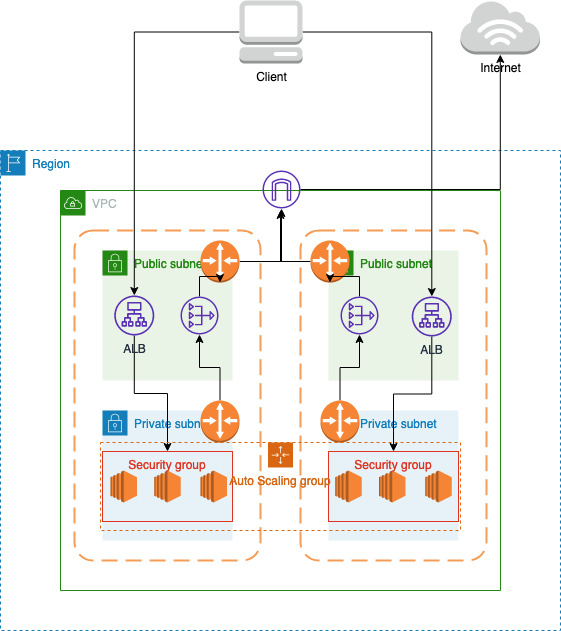
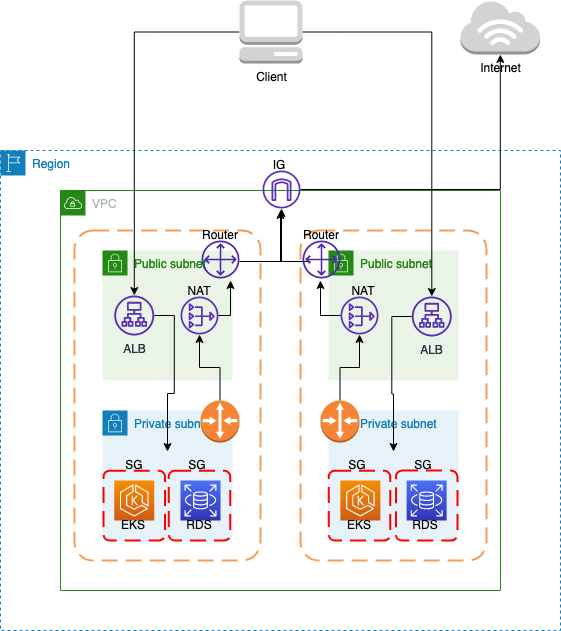
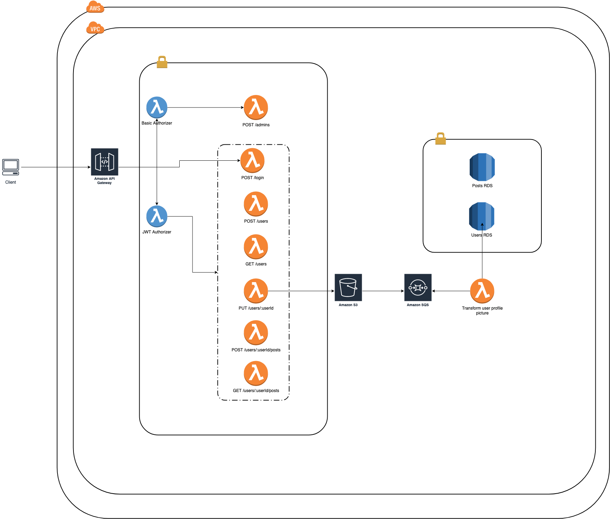

# What is this repository for? #
Collection of backend apps to simulate microservices ecosystem. We are using Terraform to deploy these microservices to AWS. Currently we support deploying using:
- ECS with Fargate
- ECS with EC2
- EKS
- Lambdas and API-Gateway for serverless flow

## Architecture Flow

Below we attach flow pipelines for the microservices:

### ECS
Cloud Architecture for ECS:
 <br />
 

### EKS
Cloud Architecture for EKS:
 <br />
 

### Serverless (API-Gateway and Lambdas)
Cloud Architecture for Serverless:
 <br />
 

### Deploy services: ###

In order to deploy microservices in AWS run the following cmd:

```shell
deploy.sh
```

and then specify the ECS deployment type, picking fargate or ec2.

### Destroy services: ###

In order to destroy clusters from AWS run the following cmd:

```shell
destroy.sh
```

## Show your support

Give a ⭐️ if this project helped you!
