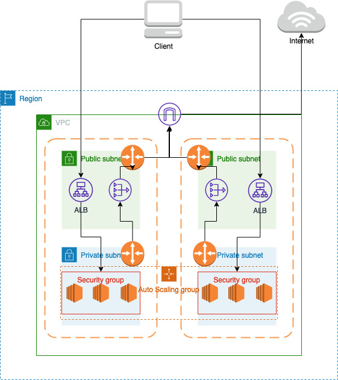

# What is this repository for? #
Collection of backend apps to simulate MS ecosystem. We are using Terraform to deploy microservices to AWS. Currently we support deploying using ECS Fargate and ECS EC2.

## Architecture Flow

The flow pipeline for our microservice ecosystem is the 

### Deploy services: ###

In order to deploy microservices in AWS run the following cmd:

```shell
bash deploy.sh
```

and then specify the ECS deployment type, picking fargate or ec2.

### Destroy services: ###

In order to destroy clusters from AWS run the following cmd:

```shell
bash destroy.sh
```
