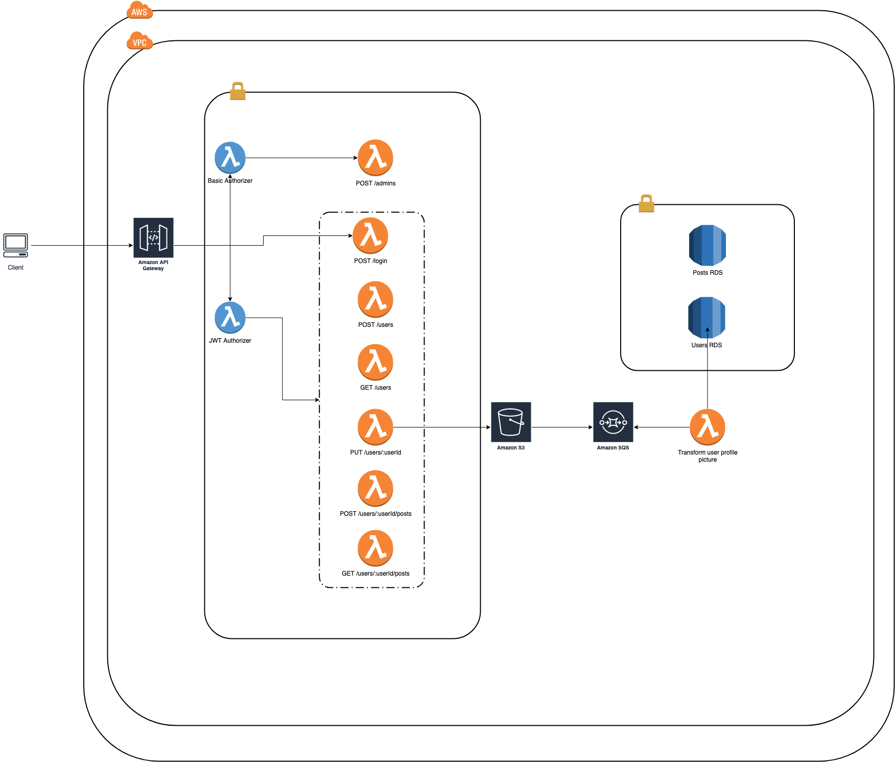

# What is this folder for? #
Collection of lambdas apps to simulate a serverless ecosystem. We are using Terraform to deploy lambdas to AWS.

## Architecture Flow

The flow pipeline for our microservice ecosystem is the 

### Deploy services: ###

In order to deploy lambdas in AWS run the following cmds:

```shell
deploy.sh
```

and then select lambda as input type.

### Destroy services: ###

In order to destroy clusters from AWS run the following cmd:

```shell
destroy.sh
```
